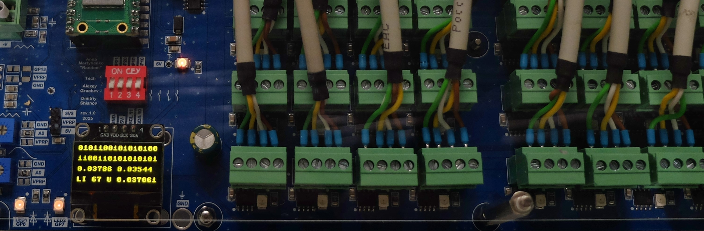

[ [profile](#profile)  ] &nbsp; [ [prj](#prj) ] &nbsp; [ [art](#art) ] &nbsp; [ [img](#img) ] &nbsp;  [ [contacts](#contacts) ] 

----

### profile

  Hi! I’m Dima — an electronic engineer passionate about technology, nature, sci-art, and cycling. 
My main focuses are PCB development, industrial automation, and IoT, as well as collaborations with artists and my own creative projects.

---

###  art

##### as engineer and artist
* [corrasion] 
* [the measure of chaos]
* [field]
  
##### as engineer
* [bacteria as a service]
* [noise spores]

---

###  prj

##### electronics design

* [PIndustrial - Power Supply + RS-485 HAT for Raspberry] 

##### lighthouse museum projects
* [lighthouse lamp changer restoration](#lighthouse-lamp-changer-restoration)
* [weather station](#weather-station)
* [light characteristic demo installation](#light-characteristic-demo-installation)

---

### contacts

* [telegram] 
* dmtshsh@gmail.com
* [telegram channel] 
* [insta]
* [linkedin]
  
---

##### lighthouse lamp changer restoration

- mechanics restoration, cleaning, and lubrication
- electronic control system design and programming
- integration with the museum weather station for change counting. 
It is now more than 9,000 changes!

{: style="height:400px"}    {: style="height:400px"}

---

##### weather station

Old soviet weather station restoration:
- mechanics restoration with original parts preservation and usage
- new electronics design for signal acquisition from old sensors
- server and local PC programming for data storage and visualisation

{: style="height:400px"}    {: style="height:400px"}

---
#### light characteristic demo installation

Interactive installation showing different light characteristics. The visitor can choose a real local lighthouse on the touchscreen, read a caption about it, and observe its light characteristic on a real lens lantern:
- programming
- user interface design
- lens lantern modification for custom multicolor LED light

{: style="height:400px"}    {: style="height:400px"}

----

### img

[insta]: https://www.instagram.com/dm_shsh
[telegram channel]: https://t.me/all_these_things 
[corrasion]: https://www.cyland.org/made-in-cyland-catalogue/corrasion
[the measure of chaos]: https://www.cyland.org/made-in-cyland-catalogue/the-measure-of-chaos
[field]: https://www.cyland.org/made-in-cyland-catalogue/field-
[linkedin]: https://www.linkedin.com/in/dm-sh
[telegram]: https://t.me/dmitriy_shi
[PIndustrial - Power Supply + RS-485 HAT for Raspberry]: https://www.hackster.io/dm_sh/pindustrial-power-supply-rs-485-hat-for-raspberry-3950f0
[bacteria as a service]: https://annamartynenko.ru/project/2025-random
[noise spores]: https://garagemca.org/ru/open-storage/anna-martynenko-noise-spores

