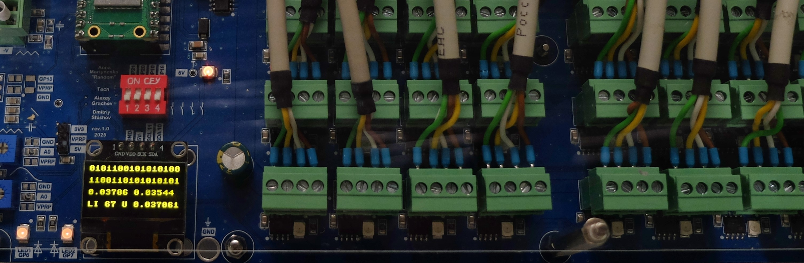
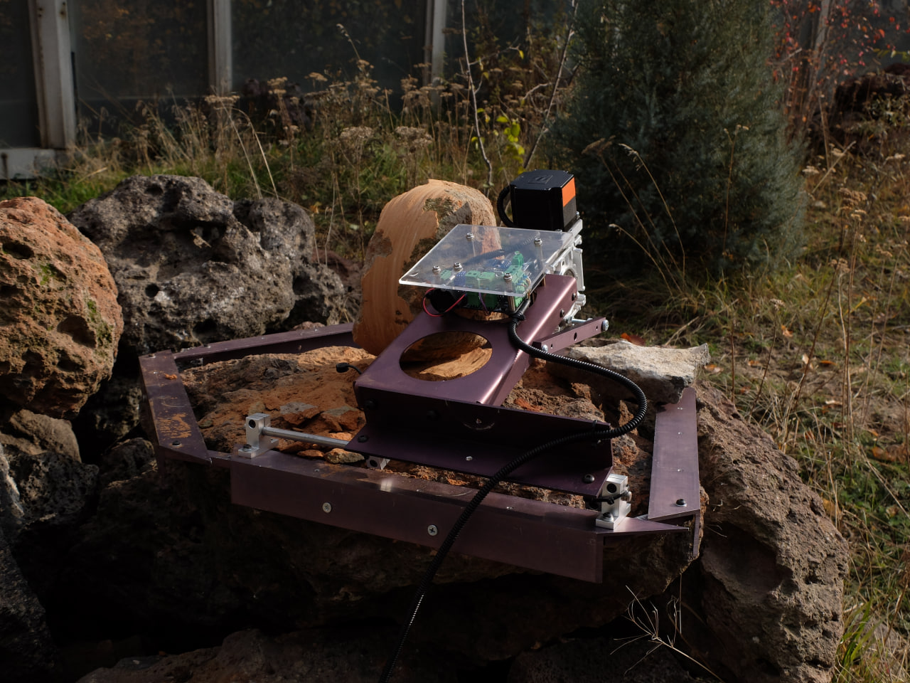
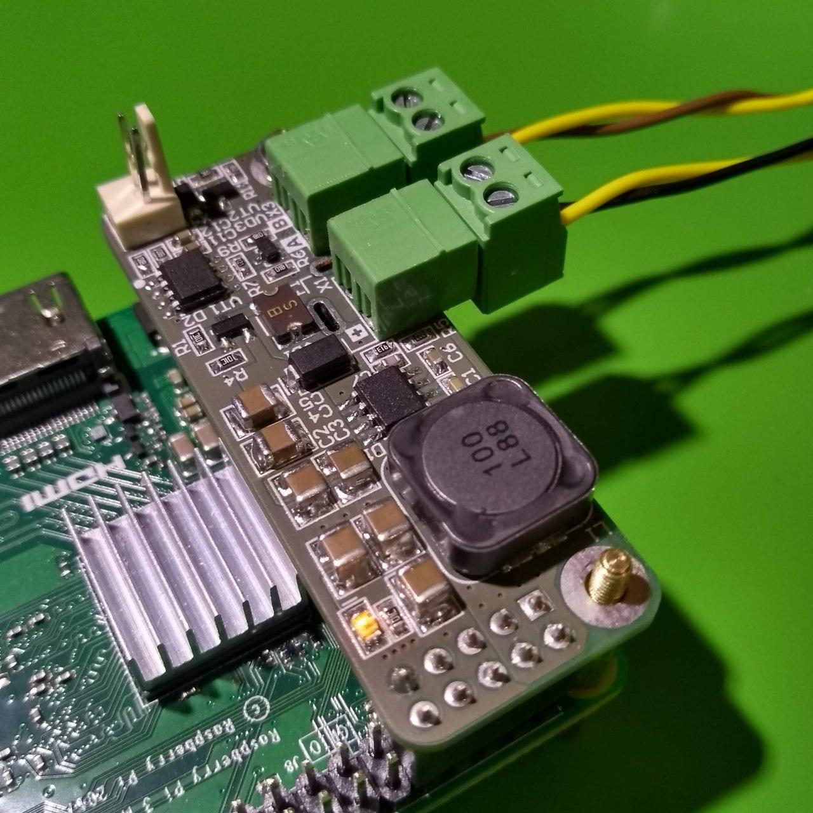

[ [profile](#profile)  ] &nbsp; [ [prj](#prj) ] &nbsp; [ [art](#art) ] &nbsp; [ [img](#img) ] &nbsp;  [ [contacts](#contacts) ] 

----

### profile
----
    Hi! I’m Dima — an electronic engineer passionate about technology, nature, sci-art, and cycling. 
  My main focuses are PCB development, industrial automation, and IoT, as well as collaborations with artists and my own creative projects.

###  art
----
* [corrasion] 
* [the measure of chaos]
* [field] 

###  prj
----
* [PIndustrial - Power Supply + RS-485 HAT for Raspberry] 

### contacts
----
* [telegram] 
* dmtshsh@gmail.com
* [telegram channel] 
* [insta]
* [linkedin]
  

### img
----

[insta]: https://www.instagram.com/dm_shsh
[telegram channel]: https://t.me/all_these_things 
[corrasion]: https://www.cyland.org/made-in-cyland-catalogue/corrasion
[the measure of chaos]: https://www.cyland.org/made-in-cyland-catalogue/the-measure-of-chaos
[field]: https://www.cyland.org/made-in-cyland-catalogue/field-
[linkedin]: https://www.linkedin.com/in/dm-sh
[telegram]: https://t.me/dmitriy_shi
[PIndustrial - Power Supply + RS-485 HAT for Raspberry]: https://www.hackster.io/dm_sh/pindustrial-power-supply-rs-485-hat-for-raspberry-3950f0

